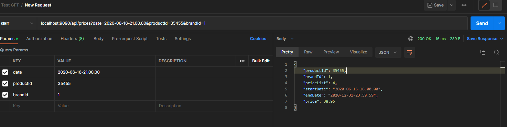

# Project: Test Inditex GFT 2020

Este proyecto es una aplicación Spring Boot que gestiona la información de precios y productos para una tienda.

## Características

- Gestión de precios en función de la fecha, producto y marca.
- Excepciones personalizadas para la gestión de errores.
- Controlador de excepciones y manejo de errores.
- Pruebas unitarias para la capa de servicios.

## Tecnologías y herramientas utilizadas

- Java 11
- Spring Boot
- Spring Data JPA
- Hibernate
- Mockito (para pruebas unitarias)
- Lombok
- H2 (base de datos en memoria)

## Estructura del proyecto

El proyecto sigue la estructura típica de una aplicación Spring Boot:

- `controller`: Contiene la clase `PriceController`, que expone los endpoints de la API REST.
- `exception`: Contiene la excepción personalizada `PriceNotFoundException`.
- `entity`: Contiene las clases de entidad `Price`, `Brand`.
- `model`: Contiene las clase de dominio `PriceResponse`.
- `repository`: Contiene la interfaz `PriceRepository` que extiende `JpaRepository` y define consultas personalizadas.
- `service`: Contiene la interfaz `PriceService` y su implementación `PriceServiceImpl`.

## Cómo ejecutar el proyecto

1. Asegúrate de tener instalado Java 11 (o una versión posterior) en tu sistema.
2. Clona este repositorio en tu máquina local.
3. Navega hasta el directorio del proyecto en una terminal o línea de comandos.
4. Ejecuta el siguiente comando para iniciar la aplicación Spring Boot

## Ejemplo con Postman

